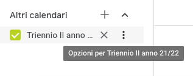
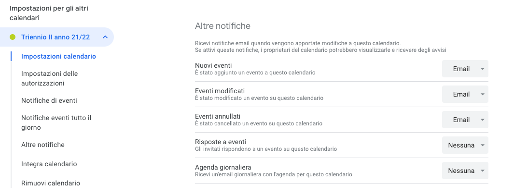

---
hide:
  - toc
---
# Abilita le notifiche

### 1

Seleziona i tre puntini (opzioni) del calendario di interesse e poi clicca "Impostazioni".

---

### 2

Nella voce "altre notifiche" abilita: Nuovi eventi, Eventi modificati ed Eventi annullati. 

