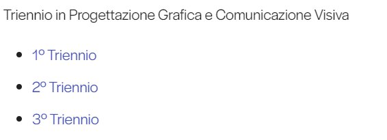
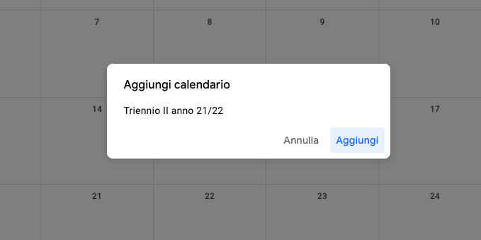
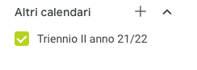

---
hide:
  - toc
---
# Aggiungi al Google Calendar

(Non tutti i dispositivi seguono questo procedimento, alcuni richiedono l’installazione dell'app di Google Calendar)

### 1

Clicca sul link del calendario del corso d'interesse

---

### 2

Clicca su "Aggiungi" per poter aggiungere il calendario su calendar.google.com

---

### 3

Il calendario apparirà su "altri calendari", per essere visualizzato deve essere attivato

### 4

Il calendario apparirà su "Altri calendari". Per essere visualizzato deve essere attivato

